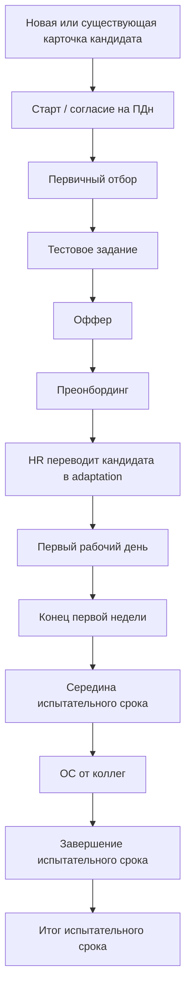

# Бизнес-каталог сценариев

Этот документ описывает сценарии как бизнес-процессы: кому они отправляются, как запускаются, какие шаги проходят, какие поля карточки меняют и где есть переходы в другие сценарии.

Статус документа: draft. Это снимок текущей локальной SQLite-базы `D:\HRBot\hr_bot_stage_pipeline\hr_bot.db` на 2026-08-06, а не утвержденный регламент. База содержит много тестовых сценариев, поэтому каталог нужно читать как рабочий материал для согласования с владельцем продукта.

Командная review-копия: https://docs.google.com/document/d/1UjFnLJVFzAXrxuLvPeVvSZmCiQLCFQzBDAKz5Mo374s. Она нужна для комментариев и правок коллег, но не заменяет git-документ. Подтвержденные изменения из Google Docs должны переноситься обратно сюда.

## Что Уже Есть

В системе есть три связанных слоя:

- Карточка человека: одна таблица `employees` хранит кандидатов, адаптантов и сотрудников.
- Сценарий: `scenario_templates` хранит настройки сценария, `flow_step_templates` хранит шаги.
- Исполнение: `scenario_progress` и `flow_launch_requests` хранят текущий прогресс, ожидание ответа и отложенные запуски.

На уровне бизнес-процесса сценарий обычно делает одно или несколько действий:

- отправляет Telegram-сообщение;
- ждет ответ текстом, файлом, датой или кнопкой;
- записывает ответ в поле карточки через `target_field`;
- отправляет файл, ссылку или карточку сотрудника;
- отправляет уведомление HR/ответственному;
- запускает другой сценарий через `launch_scenario_key`;
- завершает текущий процесс.

## Ограничения Снимка

Текущая заполненная БД не является чистым каталогом:

| Показатель | Значение |
| --- | ---: |
| Карточек `employees` | 150 |
| Шаблонов сценариев `scenario_templates` | 299 |
| Шагов `flow_step_templates` | 357 |
| Runtime progress `scenario_progress` | 349 |
| Pending launch requests `flow_launch_requests` | 75 |
| Step-level notification rules | 0 |
| Button notification rules | 2 |

Загрязнение сценариев:

| Prefix | Количество | Как читать |
| --- | ---: | --- |
| `test_%` | 141 | Тестовые записи, не включать в бизнес-регламент. |
| `codex_%` | 140 | Агентские/проверочные записи, не включать в бизнес-регламент. |
| `custom_%` | 5 | Часть похожа на реальные сценарии, но требует ручного подтверждения. |
| `scenario_%` | 5 | Часть похожа на реальные сценарии, но ключи технические. |

Отдельный риск: в этой БД `recruitment_hiring` имеет `trigger_mode=manual_only`, хотя seed-код и текущая продуктовая модель ожидают стартовый сценарий от `bot_registration`. До утверждения источника правды это нельзя считать финальным поведением.

Текущий stage-код уже содержит recipient-контракт, но этот каталог был составлен по локальному DB-снимку, где бизнес-паспорта еще не нормализованы вокруг `recipient_mode`. Поэтому для каждого сценария дальше нужно явно подтвердить: “о чьей карточке процесс” и “кому бот отправляет сообщение”.

## Карточки И Статусы

Фактическое состояние карточек в локальной БД:

| `employee_stage` | `candidate_work_stage` | `candidate_status` | Кол-во | Комментарий |
| --- | --- | --- | ---: | --- |
| `candidate` | empty | empty | 84 | Кандидаты без активного runtime/status marker. |
| `candidate` | empty | `step_one` | 51 | Похоже на legacy/test marker, не бизнес-этап. |
| `candidate` | empty | `workday_step` | 9 | Похоже на legacy/test marker, не бизнес-этап. |
| `staff` | empty | `new` | 2 | Сотрудники без candidate-stage. |
| `adaptation` | empty | step key | 1 | Адаптант с runtime marker в `candidate_status`. |
| `candidate` | `testing` | `new` | 1 | Кандидат на этапе тестирования. |
| `candidate` | `testing` | step key | 2 | Кандидаты на тестировании с runtime marker. |

Вывод: для бизнес-аналитики нельзя использовать `candidate_status` как чистый HR-статус. Он смешивает runtime-метку последнего шага и бизнес-состояние. Для процессов подбора более надежное поле сейчас `candidate_work_stage`, но в локальной БД оно заполнено слабо.

## Настройки Сценария

Основные настройки, которые важны бизнесу:

| Поле | Смысл |
| --- | --- |
| `scenario_key` | Стабильный технический ключ сценария. Нужен для переходов и переносимости. |
| `title` | Название для оператора. |
| `scenario_kind` | `scenario` для процесса, `survey` для опроса. |
| `employee_scope` | Кого можно запускать: `candidates`, `employees`, `all`. |
| `role_scope` | Должность/роль получателя или `all`. Сейчас это строка/CSV, не FK. |
| `trigger_mode` | Как сценарий запускается. |
| `candidate_work_stage_trigger` | Какой HR-этап кандидата запускает сценарий, если `trigger_mode=candidate_hr_stage`. |
| `target_employee_id` | Точечная привязка к одной карточке, если нужна. |

Recipient-контракт добавляет обязательную бизнес-настройку:

| Поле | Смысл |
| --- | --- |
| `recipient_mode` | Кому отправлять Telegram-сообщения: самому человеку, руководителю, наставнику адаптации, наставнику ИПР или HR. |

## Типы Запуска

| `trigger_mode` | Бизнес-смысл | Условия запуска |
| --- | --- | --- |
| `manual_only` | Оператор запускает вручную из карточки, массового действия, меню или другого UI. | Карточка подходит по `employee_scope` и `role_scope`; у получателя должна быть Telegram-привязка. |
| `bot_registration` | Сценарий стартует после новой привязки Telegram к карточке. | Пользователь известен/привязан; повторный `/start` не должен перезапускать регистрацию. |
| `candidate_hr_stage` | Сценарий стартует при смене HR-этапа кандидата. | В карточке реально изменился `candidate_work_stage` на значение из `candidate_work_stage_trigger`. |
| `scenario_transition` | Сценарий стартует из другого сценария. | Предыдущий шаг содержит `launch_scenario_key`. |
| `first_workday` | Первый рабочий день. | У сотрудника заполнен `first_workday`; scheduler доставляет timed steps в день выхода. |
| `first_week_friday` | Конец первой недели. | Рассчитывается от `first_workday`. |
| `mid_probation` | Середина испытательного срока. | Используется `adaptation_midpoint` или расчетная дата. |
| `end_probation` | Завершение испытательного срока. | Используется `adaptation_end` или расчетная дата. |
| `manager_assigned_adaptation` | После назначения руководителя адаптанту. | Требует отдельного уточнения: сейчас важно не потерять контекст, о каком адаптанте идет речь. |

## Карта Основных Процессов

Эта схема отражает ожидаемый бизнес-процесс, но не означает, что все переходы уже строго автоматизированы. В текущей БД часть сценариев запускается вручную, а часть переходов задана через `launch_scenario_key`.

## Каталог Сценариев

### Стартовый Сценарий

| Поле | Значение |
| --- | --- |
| Key | `recruitment_hiring` |
| Название в БД | Стартовый сценарий |
| Аудитория | `candidates` |
| Trigger в БД | `manual_only` |
| Ожидаемый trigger по продуктовой модели | `bot_registration` |
| Кому отправляется | Требует явного подтверждения `recipient_mode`; по старой БД фактически сам привязанный Telegram-пользователь. |

Бизнес-смысл: первичный вход кандидата в бота, приветствие, согласие на обработку ПДн и сбор базовых данных.

Шаги:

1. Приветствие с логотипом.
2. Согласие на ПДн, вложение соглашения.
3. Если кандидат согласен, бот спрашивает: кандидат или сотрудник.
4. Для ветки “кандидат” запускается `scenario_1356b4dcfd1d`.
5. Дополнительно в БД есть legacy-блок сбора ФИО, должности, резюме и зарплатных ожиданий.
6. Если пользователь не согласен, сценарий сообщает, что общение через бот невозможно.

Проблемы:

- В БД одновременно есть новый и старый вариант согласия на ПДн.
- Trigger расходится с seed-кодом.
- Ветка “Я - сотрудник” не описана как полноценный бизнес-процесс.

### Первичный Отбор Кандидата

| Поле | Значение |
| --- | --- |
| Key | `scenario_1356b4dcfd1d` |
| Название | Первичный отбор кандидата |
| Аудитория | `all`, фактически кандидаты |
| Trigger | `manual_only`, но используется как переход из стартового сценария |
| Переход дальше | `custom_scenario_1776085144` |

Бизнес-смысл: собрать первичные данные кандидата и объяснить процесс собеседования.

Шаги:

1. Запрос ФИО.
2. Выбор интересной должности: дизайнер, аналитик, руководитель проекта.
3. Выбор комфортного дохода.
4. Запрос резюме файлом.
5. Благодарность за резюме.
6. Объяснение дальнейшего процесса собеседования.
7. Финальное ожидание обратной связи.
8. По кнопке “Ок, жду!” запускается тестовое задание `custom_scenario_1776085144`.

Проблемы:

- `target_field` для части бизнес-ответов не заполнен, поэтому не все ответы структурно попадают в карточку.
- Название следующего сценария содержит “н раб”, что выглядит как рабочая копия.

### Тестовое Задание Для Дизайнера

В БД есть два похожих сценария.

| Key | Название | Trigger | Комментарий |
| --- | --- | --- | --- |
| `scenario_79dff913f06d` | Тестовое задание (дизайнер) | `manual_only` | Более старый/общий вариант, в конце запускает `recruitment_hiring`, что выглядит как ошибочный цикл. |
| `custom_scenario_1776085144` | Тестовое задание (дизайнер)н раб | `scenario_transition` | Похоже на текущий рабочий вариант после первичного отбора. |

Ожидаемый бизнес-смысл: отправить кандидату тестовое задание, принять файл или ссылку результата, затем перейти к офферу или ручной оценке HR.

Шаги рабочего варианта `custom_scenario_1776085144`:

1. Поздравление после собеседования с руководителем.
2. Ветка “Готов выполнить” продолжает процесс; ветка “Не буду выполнять” завершает коммуникацию.
3. Отправка тестового задания со сроком 4 рабочих дня.
4. Кандидат нажимает “Задание выполнено”.
5. Бот просит прислать результат файлом или ссылкой.
6. Результат сохраняется в `candidate_file`.
7. Финальная благодарность содержит `launch_scenario_key=custom_scenario_54fa7a6cc694`.

Проблемы:

- В рабочем варианте финальный шаг имеет `response_type=none`, но содержит `launch_scenario_key`; нужно подтвердить, что runtime всегда запускает следующий сценарий из такого шага.
- Старый вариант `scenario_79dff913f06d` зацикливает кандидата обратно в `recruitment_hiring`.

### Оффер

| Поле | Значение |
| --- | --- |
| Key | `custom_scenario_54fa7a6cc694` |
| Название | Оффер |
| Trigger | `manual_only`, но ожидается запуск после тестового задания |
| Документ | Используется слот `{doc:Оффер}` |

Бизнес-смысл: сообщить кандидату, что компания готова сделать предложение, отправить оффер и получить ответ.

Шаги:

1. Поздравление с успешным выполнением тестового задания.
2. Вопрос: готов ли кандидат рассмотреть предложение.
3. Если “Да”, бот отправляет оффер через document slot `{doc:Оффер}`.
4. Кандидат выбирает “Принимаю оффер” или “Не принимаю оффер”.
5. При принятии бот просит дату выхода.
6. Далее бот сообщает, что за день до выхода отправит список документов.

Проблемы:

- В БД есть тестовые ветки с текстом вида `ветка а{name}{full_name}`.
- Принятие оффера не переводит кандидата в `adaptation` автоматически. По текущей безопасной модели это должен делать HR отдельным действием.
- Нужно решить, писать ли дату выхода в `first_workday` через `target_field`; в текущем снимке это не выражено явно.

### Преонбординг

| Поле | Значение |
| --- | --- |
| Key | `scenario_34241a576990` |
| Название | Преонбординг |
| Trigger | `manual_only` |
| Аудитория | `all`, фактически кандидат перед выходом |

Бизнес-смысл: напомнить о первом рабочем дне, отправить список документов, получить подтверждение подготовки.

Шаги:

1. Приветствие за день до выхода.
2. Отправка списка документов для трудоустройства, вложение `Документы для трудоустройства.docx`.
3. Запрос согласия на обработку ПДн перед загрузкой документов.
4. При согласии процесс идет дальше; при отказе бот обещает связь специалиста.
5. Запрос загрузить собранные документы по ссылке и нажать “Документы загружены”.
6. Подтверждение, что специалист проверит документы.
7. Финальное сообщение “до встречи”.

Проблемы:

- Сценарий фактически про кандидата перед трудоустройством, но `employee_scope=all`.
- Несколько внутренних веток содержат заглушки.
- Нет явной структурной проверки, какие документы обязательны.

### Первый Рабочий День

| Поле | Значение |
| --- | --- |
| Key | `first_day` |
| Название | Первый рабочий день |
| Trigger | `first_workday` |
| Аудитория | `employees` |

Бизнес-смысл: сопровождение сотрудника в первый рабочий день по расписанию.

Условия запуска:

- карточка должна быть сотрудником/адаптантом, подходящим под employee scope;
- должен быть заполнен `first_workday`;
- Telegram должен быть привязан к получателю.

Таймлайн:

| Время | Сообщение |
| --- | --- |
| 10:00 | Старт дня и встреча с HR. |
| 11:00 | Анкета нового сотрудника. |
| 11:30 | Документы. |
| 12:00 | Встреча с руководителем. |
| 13:00 | Обед. |
| 14:00 | Доступы. |
| 15:00 | Структура компании. |
| 16:00 | Бизнес-процессы. |
| 17:00 | Анализ дня. |
| 18:00 | Анкета/оценка дня с кнопками `1`, `2`, `3`. |

Проблемы:

- В локальной БД есть дополнительный “Новый шаг” с placeholder-текстом.
- Часть ссылок выглядит как example.com, то есть требует замены на реальные документы/формы.

### Конец Первой Недели

| Поле | Значение |
| --- | --- |
| Key | `first_week` |
| Название | Конец первой недели |
| Trigger | `first_week_friday` |
| Аудитория | `employees` |

Бизнес-смысл: подготовить сотрудника к обсуждению задач испытательного срока.

Таймлайн:

| Когда | Время | Сообщение |
| --- | --- | --- |
| За 1 рабочий день | 10:00 | Информирование о встрече, вложение документа. |
| За 1 рабочий день | 12:00 | Ссылка на тест. |
| В день встречи | 10:00 | Напоминание о задачах и встрече. |

Проблемы:

- Используются placeholders `{date}`, `{time}`, `{test_url}`. Нужно проверить, какие поля карточки или slots реально их заполняют.

### Середина Испытательного Срока

| Поле | Значение |
| --- | --- |
| Key | `mid_probation` |
| Название | Середина испытательного срока |
| Trigger | `mid_probation` |
| Аудитория | `employees` |

Бизнес-смысл: напомнить о промежуточной встрече, тесте и практическом задании.

Таймлайн:

| Когда | Время | Сообщение |
| --- | --- | --- |
| За 1 рабочий день | 10:00 | Информирование о встрече. |
| За 1 рабочий день | 12:00 | Тест. |
| За 1 рабочий день | 14:00 | Практическое задание. |
| В день встречи | 10:00 | Напоминание о промежуточной встрече. |

### Завершение Испытательного Срока

| Поле | Значение |
| --- | --- |
| Key | `end_probation` |
| Название | Завершение испытательного срока |
| Trigger | `end_probation` |
| Аудитория | `employees` |

Бизнес-смысл: подготовить сотрудника к финальной встрече по испытательному сроку.

Таймлайн:

| Когда | Время | Сообщение |
| --- | --- | --- |
| За 1 рабочий день | 10:00 | Напоминание о конце ИС. |
| За 1 рабочий день | 12:00 | Тест. |
| За 1 рабочий день | 14:00 | Практическое задание. |
| В день встречи | 10:00 | Напоминание о финальной встрече. |

### Обратная Связь От Коллег

| Key | Название | Trigger | Время |
| --- | --- | --- | --- |
| `mid_feedback` | ОС от коллег (середина ИС) | `manual_only` | 16:00 |
| `end_feedback` | ОС от коллег (конец ИС) | `manual_only` | 16:00 |
| `custom_scenario_043e63fdfecc` | ОС от коллег (конец ИС) (копия) | `manual_only` | Требует проверки |

Бизнес-смысл: отправить сотруднику ссылку на обратную связь от коллег через placeholder `{feedback_url}`.

Проблемы:

- Нужен источник `{feedback_url}`: карточка, документный slot, ручной ввод HR или внешний сервис.
- Копия сценария должна быть либо утверждена как отдельный процесс, либо архивирована/удалена после ревизии.

### Итог Испытательного Срока

| Поле | Значение |
| --- | --- |
| Key | `end_summary` |
| Название | Итог испытательного срока |
| Trigger | `manual_only` |
| Время | 18:00 |

Бизнес-смысл: поздравить с успешным завершением ИС и попросить видео-визитку.

Проблемы:

- В БД есть копия `custom_scenario_1ad89186ae04`; нужно решить, какая версия рабочая.
- Нет явной связи с переводом `adaptation -> staff`.

### Организация Адаптации

| Поле | Значение |
| --- | --- |
| Key | `scenario_6c14bc1720c2` |
| Название | Организация адаптации |
| Trigger | `manual_only` |
| Ожидаемый получатель | Руководитель или HR, требует явного `recipient_mode` |

Бизнес-смысл: уведомить ответственного о выходе нового сотрудника и назначить наставника.

Шаги:

1. Сообщение о том, что вышел новый сотрудник.
2. Просьба назначить наставника.
3. Ввод имени наставника текстом.
4. Подтверждение “ДА/НЕТ”.
5. При “ДА” бот сообщает, что уведомит наставника и новичка.
6. При “НЕТ” просит выбрать наставника заново.

Проблемы:

- Ответ “имя наставника” не сохраняется в `mentor_adaptation_employee_id`.
- Старые DB-снимки без recipient/subject-контракта плохо выражают, что сценарий идет руководителю о конкретном адаптанте.
- Это не должен быть обычный сценарий “на самого сотрудника”; здесь нужен recipient `manager` или `hr` и subject employee = адаптант.

### Опрос

| Поле | Значение |
| --- | --- |
| Key | `custom_survey_1775927430` |
| Название | Новый опрос |
| Kind | `survey` |
| Trigger | `manual_only` |

В текущем виде это тестовый/черновой опрос из двух вопросов с эмодзи и вариантами `1/2/3`, `4/5/6`. Не стоит включать его в бизнес-регламент без подтверждения.

## Уведомления

В текущем снимке:

- `step_send_notifications` пустой;
- `step_button_notifications` содержит 2 правила;
- часть legacy notification fields остается в `flow_step_templates`.

Бизнес-правило, которое нужно утвердить: уведомление в сценарии должно отвечать на вопрос “какое событие произошло, кто ответственный, что он должен сделать”. Без этого уведомления легко превратятся в дублирующие сообщения HR.

Минимальный формат для будущего каталога:

| Сценарий | Событие | Получатель | Текст/смысл | Обязательное действие |
| --- | --- | --- | --- | --- |
| Оффер | Кандидат принял оффер | HR | Кандидат готов выйти, нужна дата выхода и HR cutover | Проверить дату, перевести в adaptation |
| Тестовое задание | Кандидат отправил файл | HR/руководитель | Нужно проверить результат | Принять решение по офферу |
| Организация адаптации | Руководитель подтвердил наставника | Наставник/новичок/HR | Назначение принято | Проверить связи в карточке |

## Открытые Решения

Эти вопросы нельзя закрывать агенту без владельца продукта:

1. Что является источником правды для бизнес-сценариев: seed-код, stage DB или утвержденный каталог в docs.
2. Какие из `custom_*` и `scenario_*` записей являются рабочими, а какие тестовыми.
3. Должен ли `recruitment_hiring` быть `bot_registration` во всех окружениях.
4. Может ли сценарий сам переводить кандидата в `adaptation`, или это только HR-действие.
5. Какие HR-этапы кандидата запускают сценарии автоматически.
6. Что делать с `candidate_status`: оставить runtime marker или выделить отдельное бизнес-поле.
7. Какие placeholders должны быть обязательными полями карточки, а какие document slots.
8. Какие сценарии должны писать структурные поля карточки через `target_field`.
9. Какие уведомления являются обязательными и кто их получает.
10. Как в каталоге описывать сценарии, где получатель не равен subject employee.

## Как Поддерживать Каталог

Каталог обновляется, когда меняется бизнес-сценарий, trigger, получатель, переход, обязательное поле карточки или notification rule.

Не обновлять каталог ради:

- косметики текста сообщения;
- правки emoji;
- временного тестового сценария;
- технического refactor без изменения поведения.

Перед тем как сделать документ `source_of_truth: true`, нужно:

1. Очистить или изолировать `test_%` и `codex_%` сценарии.
2. Утвердить список рабочих сценариев.
3. Обновить каждый паспорт сценария по `recipient_mode`.
4. Сверить catalog с stage DB, а не только с локальной копией.
5. Перенести подтвержденные правила в [[features/scenario-engine]], [[features/employee-lifecycle]] и [[features/notifications]].
