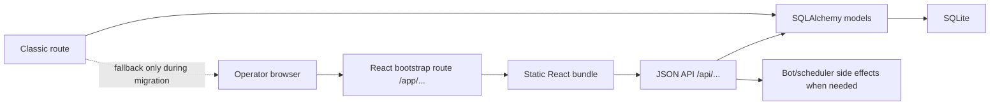

# LLD миграции classic admin UI на React

## Контекст

Админка сейчас hybrid:

- React/Vite уже покрывает список сотрудников/кандидатов, scenario workspace и survey workspace mode.
- Детальная карточка сотрудника/кандидата теперь собрана через Vite bundle `frontend/src/employee-detail/`, но еще не приведена к нормальной page composition.
- Classic Jinja UI все еще держит fallback для settings, bulk actions, surveys, старых flow pages и части employee form actions.
- Оба UI мутируют одни и те же таблицы, поэтому длительное сосуществование повышает риск contract drift.

Цель не в том, чтобы “переписать все красиво”, а в том, чтобы убрать parallel write surfaces и сделать React основной операторской поверхностью без потери rollback.

## Цель

- Сделать React admin default entry для операторов.
- Постепенно перенести classic-only страницы в React.
- Для каждого переноса заменить form POST + redirect на JSON API + explicit client state.
- Classic UI оставить как временный fallback на прямых URL до прохождения smoke checks на stage.
- После покрытия всех critical flows сохранить last-known-good classic UI через git tag/branch и удалить classic navigation.

## Текущее состояние

React default уже частично есть:

- `/app/employees` — React список сотрудников.
- `/app/employees?list_kind=candidates` — React список кандидатов.
- `/app/employees/{employee_id}` — React карточка.
- `/app/flows/workspace-v2` — React scenario workspace.
- `/app/surveys/workspace` — React survey workspace через общий scenario workspace bundle с `kind=survey`.
- `/app/settings` — React settings/accounts/menu sets.
- `/app/bulk-actions` — React bulk actions.

Classic-only или mostly-classic:

- `/bulk-actions` — fallback для массовых сценариев, сообщений, опросов.
- `/settings` — fallback для HR settings, menu sets, menu buttons, admin accounts.
- `/surveys`, `/surveys/{scenario_id}`, `/surveys/{scenario_id}/export` — classic fallback и export.
- `/flows`, `/flows/{scenario_id}` — legacy fallback для сценариев.
- Classic employee routes — fallback form actions для карточки, файлов, document links, schedule/launch.

Архитектурная проблема внутри новых React routes:

- часть экранов до сих пор собрана как крупные `main.tsx`, где смешаны bootstrap, screen layout, page-only components и статический config;
- это уже замедляет разработку сильнее, чем отсутствие отдельной UI reference page;
- отдельный `employee detail` уже перенесен в общий Vite/shared-ui runtime, но пока остается большим page-монолитом и еще не служит хорошим примером композиции.

## Приоритет страниц

| Приоритет | Страница | Почему |
| --- | --- | --- |
| P0 | React default entry и navigation | Уменьшает использование classic без удаления fallback. |
| P1 | Settings / accounts / menu sets | Изолированный admin-only surface; хороший первый паттерн JSON API для classic form actions. |
| P2 | Bulk actions | Высокая ценность, но высокий риск ошибочной массовой отправки; делать после API contract и smoke checks. |
| P3 | Surveys | Реализовано как `kind=survey` mode общего React workspace; classic остается fallback/export. |
| P4 | Legacy employee form actions | React карточка уже есть, но нужно закрыть все gaps и оставить classic только как rollback. |
| P5 | Legacy flows pages | Удалять после стабилизации React scenario workspace и survey strategy. |

## Предлагаемое устройство

Миграция идет вертикальными срезами:

1. Для страницы фиксируется current classic behavior.
2. Добавляется JSON API рядом с существующими form routes.
3. Добавляется React bootstrap route `/app/...`.
4. Sidebar и redirects переводятся на React route.
5. Classic route остается доступен прямым URL как fallback.
6. После stage smoke checks classic route удаляется из navigation и помечается deprecated.

Запрещенный путь: сначала удалить classic routes, а потом “догонять” API и баги. Это создаст большой rollback gap.

Параллельное правило композиции React-страниц:

1. `main.tsx` только bootstrap.
2. Корневой экран переносится в `page.tsx` или `screen.tsx`.
3. Крупные локальные блоки живут в `components/` рядом со страницей.
4. Page-specific constants, menus и field schemas живут в `data.ts` или `config.ts`.
5. Shared UI поднимается в `frontend/src/components/ui/*` только после того, как у него есть честно общий API, а не после одного похожего usage.

## Data flow

## API / schema / interfaces

### React default entry

| Classic behavior | New default |
| --- | --- |
| `GET /` redirects to `/candidates` | redirect to `/app/employees?list_kind=candidates` |
| successful `POST /login` redirects to `/employees` | redirect to `/app/employees?list_kind=candidates` |
| sidebar has separate candidates link to `/candidates` | remove duplicate sidebar entry; keep one `Сотрудники` link to `/app/employees`, with candidates available inside the shared React surface |
| sidebar employees link points to `/app/employees` | keep `/app/employees` |
| classic `/candidates` and `/employees` | keep direct fallback routes |

### Settings / accounts / menu sets

Current form routes to replace with JSON API:

| Current route | React API candidate | Functionality |
| --- | --- | --- |
| `GET /settings` | `GET /api/settings/workspace` | Load HR settings, menu sets/buttons, available scenarios, accounts for admin. |
| `POST /settings` | `POST /api/settings/hr` | Update `HRSettings`. |
| `POST /settings/menu-sets` | `POST /api/settings/menu-sets` | Create menu set. |
| `POST /settings/menu-sets/{menu_set_id}` | `POST /api/settings/menu-sets/{menu_set_id}` | Update menu set. |
| `POST /settings/menu-sets/{menu_set_id}/delete` | `DELETE /api/settings/menu-sets/{menu_set_id}` | Delete menu set. |
| `POST /settings/menu-sets/{menu_set_id}/buttons` | `POST /api/settings/menu-sets/{menu_set_id}/buttons` | Create menu button. |
| `POST /settings/menu-buttons/{button_id}` | `POST /api/settings/menu-buttons/{button_id}` | Update menu button. |
| `POST /settings/menu-buttons/{button_id}/delete` | `DELETE /api/settings/menu-buttons/{button_id}` | Delete menu button. |
| `POST /settings/menu-buttons/save-all` | `POST /api/settings/menu-buttons/bulk` | Bulk update menu buttons. |
| `POST /accounts` | `POST /api/accounts` | Create admin account. |
| `POST /accounts/{account_id}` | `POST /api/accounts/{account_id}` | Update admin account. |
| `POST /accounts/{account_id}/delete` | `DELETE /api/accounts/{account_id}` | Delete admin account. |

Status: first React slice implemented via `/app/settings`; JSON API routes above exist and classic `/settings` remains direct fallback.

### Bulk actions

Current form routes to replace with JSON API:

| Current route | React API candidate | Functionality |
| --- | --- | --- |
| `GET /bulk-actions` | `GET /api/bulk-actions/workspace` | Load scenarios, surveys, targets, scheduled actions and history. |
| `POST /bulk-actions/scenarios/schedule` | `POST /api/bulk-actions/scenarios/schedule` | Schedule mass scenario. |
| `POST /bulk-actions/scenarios/launch` | `POST /api/bulk-actions/scenarios/launch` | Launch mass scenario immediately. |
| `POST /bulk-actions/surveys/schedule` | `POST /api/bulk-actions/surveys/schedule` | Schedule mass survey. |
| `POST /bulk-actions/surveys/launch` | `POST /api/bulk-actions/surveys/launch` | Launch mass survey immediately. |
| `POST /bulk-actions/messages/schedule` | `POST /api/bulk-actions/messages/schedule` | Schedule mass message. |
| `POST /bulk-actions/messages/send` | `POST /api/bulk-actions/messages/send` | Send mass message immediately. |
| `POST /bulk-actions/scenarios/{action_id}/delete` | `DELETE /api/bulk-actions/scenarios/{action_id}` | Delete scheduled scenario/survey action. |
| `POST /bulk-actions/messages/{action_id}/delete` | `DELETE /api/bulk-actions/messages/{action_id}` | Delete scheduled message action. |

Status: React slice implemented via `/app/bulk-actions`; JSON API routes above exist. Immediate launch/send endpoints require preview-driven operator confirmation through `confirmed=true`.

Bulk actions require stronger confirmation UX than classic UI because side effects are high-impact.

### Surveys

Current routes to replace or merge:

| Current route | React API candidate | Functionality |
| --- | --- | --- |
| `GET /surveys` | reuse `/api/flows/workspace?kind=survey` or add `/api/surveys/workspace` | Survey list/workspace. |
| `POST /surveys` | API create survey | Create survey. |
| `GET /surveys/{scenario_id}` | React survey editor route | Edit survey. |
| `POST /surveys/{scenario_id}` | API update survey | Update survey and steps. |
| `POST /surveys/{scenario_id}/copy` | API copy survey | Copy survey. |
| `POST /surveys/{scenario_id}/delete` | API delete survey | Delete survey. |
| `GET /surveys/{scenario_id}/export` | keep download route | Export answers; this can remain non-JSON. |

Status: реализовано как mode общего React workspace. Sidebar ведет на `/app/surveys/workspace`, API переиспользует `/api/flows/workspace?kind=survey`, classic `/surveys/*` оставлен fallback, `GET /surveys/{scenario_id}/export` остается download route.

### Legacy employee/card routes

React card already uses `/api/employees/*`. Remaining classic routes can stay fallback until parity is proven:

- profile photo upload/delete;
- card image generation/download;
- file download route;
- old form redirects for schedule/launch/files/document links.

## Edge cases

- Admin-only settings/accounts must keep `_require_admin()` boundary.
- Bulk actions can send Telegram messages; React UX must show recipient scope before side effect.
- Existing direct bookmarks to classic routes should keep working during migration.
- Downloads/exports can remain non-JSON routes even after React migration.
- Scenario workspace currently has performance issues; поэтому classic survey routes пока сохраняются как fallback после включения `/app/surveys/workspace`.
- Live SQLite drift and lack of migrations mean schema changes must be avoided unless backed by explicit migration work.

## Тестирование

Minimum local checks:

- `GET /` redirects to React candidate list.
- `POST /login` redirects to React candidate list.
- Sidebar links for employees, scenarios and surveys go to React routes; candidates are no longer a separate sidebar entry and live inside the shared employees/candidates React surface.
- Direct `/employees`, `/candidates`, `/settings`, `/bulk-actions`, `/surveys` still work as fallback.
- JSON API auth behavior remains unchanged.

For each migrated page:

- API unauthorized returns `401` or auth redirect according to surface type.
- Create/update/delete actions match classic behavior.
- Browser smoke: page loads, save works, errors are visible, no console errors.
- Stage smoke before removing classic navigation.

## Rollout / rollback

Rollout:

1. Make React default entry while preserving classic direct routes.
2. Migrate one page group at a time.
3. Keep classic fallback for at least one stage deploy cycle.
4. After parity, create git tag/branch `archive/classic-ui-last-known-good`.
5. Remove classic navigation, then remove unused templates/routes in a separate cleanup.

Rollback:

- Repoint sidebar/login/root redirects back to classic routes.
- Keep classic routes and templates until React parity is confirmed.
- Back up stage DB before changing bulk actions, menu sets or survey schema behavior.

## Открытые вопросы

- Нужен ли feature flag для React default на stage, или достаточно rollback через git deploy?
- Какие classic routes реально используются операторами по прямым bookmarks?
- Нужно ли вводить audit log для bulk actions перед React переносом?
