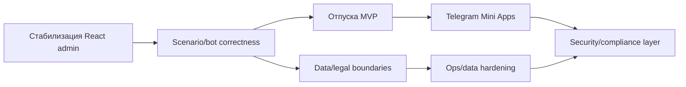

# Дорожная карта

Этот документ можно показывать как обзор направления работ. Канонические статусы задач остаются в [[backlog]], текущее состояние системы — в [[project_state]].

## Короткий тезис

За последние дни проект сдвинулся в сторону React-first operator surface с сохранением classic fallback.

Главный принцип: не удалять старый UI резко. Ключевые операторские сценарии переносим вертикальными срезами: JSON API, React page, smoke checks, classic fallback, затем cleanup.

После закрытия текущей стабилизации следующий крупный продуктовый блок — отпуска. После отпусков логичный следующий слой — Telegram Mini Apps для self-service сценариев внутри Telegram.

## Что уже сделано

| Модуль | Что изменилось | Что это дает |
| --- | --- | --- |
| Документация | Собран рабочий `docs/` vault: architecture, API, web surface, data model, stage deploy, configuration, standard, templates, maps. | Команда имеет source of truth, а не разрозненные заметки. |
| React migration | Введен LLD для перехода classic admin UI на React default. | Переезд идет управляемо, с fallback и понятным порядком работ. |
| Навигация | Root/login/sidebar переведены на React-first routes; отдельный пункт `Кандидаты` убран, сотрудники/кандидаты живут на общей странице. | Меньше дублей в навигации, меньше ощущения двух разных CRM. |
| Сотрудники/кандидаты | React list/detail уже являются основной рабочей поверхностью; classic routes остаются fallback. | Оператор может работать в новом UI, не теряя rollback. |
| Settings | Добавлен `/app/settings` и JSON API для HR settings, menu sets/buttons, admin accounts. | Админские настройки переведены в React slice. |
| Bulk actions | Добавлен `/app/bulk-actions` и JSON API для сценариев, опросов, сообщений, preview и подтверждения immediate actions. | Массовые действия стали безопаснее: immediate send/launch требует preview и `confirmed=true`. |
| Surveys | Опросы перенесены в React через общий workspace mode `/app/surveys/workspace` + `kind=survey`. | Не дублируем редактор, используем общую модель сценариев/шагов. |
| Scenario workspace | Исправлен пустой экран сценариев после runtime crash; сценарии снова рендерятся. | React workspace пригоден для демо и smoke testing. |
| UI polish | Sidebar раскрывается overlay-режимом, не сдвигая страницу; текст появляется плавнее. | Меньше layout shift и визуального дергания. |
| Bulk layout | Массовые действия изолированы от legacy `.grid`; поля больше не схлопываются в вертикальные input’ы. | Страница выглядит как рабочий dashboard, а не сломанная сетка. |
| P0 correctness | Unknown Telegram users не создают кандидатов, заблокированные пользователи не взаимодействуют с ботом, файлы/photo принимаются безопаснее, mass targeting разделяет сотрудников и кандидатов. | Меньше риска мусорных данных и ошибочных отправок. |

## Что закрываем перед новыми фичами

| Приоритет | Задача | Почему важно | Оценка |
| --- | --- | --- | --- |
| P0 | Smoke-pass React admin на stage: сотрудники, настройки, bulk, сценарии, опросы. | Нельзя идти в отпуска, если базовый операторский UI нестабилен. | 1-2 дня |
| P0 | Performance-pass scenario/survey workspace. | Workspace уже тяжелый; теперь на нем сидят и сценарии, и опросы. | 2-4 дня |
| P0 | Закрыть legacy employee/card form action gaps. | Classic fallback пока нужен, но write-surfaces надо постепенно сокращать. | 2-4 дня |
| P1 | Запуск сценария при смене HR-статуса. | Это напрямую автоматизирует HR-процесс, а не просто улучшает UI. | 2-3 дня |
| P1 | Нормализовать переход “сценарий → сценарий”. | Сейчас переход завязан на `response_type`, это слабый контракт. | 2-4 дня |
| P1 | Убрать пустые/служебные сообщения из сценариев. | Демонстрационные сценарии не должны отправлять мусор пользователю. | 1-2 дня |
| P1 | Аудит видимости новых сценариев для ручного запуска. | Если оператор создал сценарий, он должен быть предсказуемо доступен. | 1-2 дня |
| P1 | Унификация уведомлений. | Сейчас уведомления размазаны по нескольким механизмам. | 4-7 дней |

## План по модулям

| Модуль | Фокус | Выход |
| --- | --- | --- |
| A. React admin parity | Закрыть текущие UI/UX и form-action хвосты. | React становится default operator UI, classic остается rollback. |
| B. Scenario/bot correctness | Статусные триггеры, переходы, пустые сообщения, видимость сценариев. | Сценарии работают ближе к реальному HR-process, а не только вручную. |
| C. Identity/lifecycle | Привязка текущих сотрудников и перевод кандидата в сотрудника. | Telegram identity и lifecycle перестают быть неявными правилами. |
| D. MVP отпусков | Заявки, статусы, базовые уведомления и админский список. | Новый бизнес-модуль после стабилизации текущей платформы. |
| E. Data/legal boundaries | Разделение данных по двум ИП и отображение принадлежности в UI. | Персональные данные не смешиваются между юридическими контурами. |
| F. Telegram Mini Apps | Self-service UI внутри Telegram поверх stable API. | Первый production-ready mini app flow, вероятнее всего через отпуска. |
| G. Ops/data maturity | Migration strategy, stage smoke, backup/runbook дисциплина. | Меньше риска поломать данные при новых модулях. |
| H. Security/compliance layer | Доступы, аудит, защита данных, секреты, backup policy и hardening. | Данные защищены “как положено”, а не только функционально доступны. |

## Модуль A. React admin parity

Цель: сделать текущую админку безопасной для регулярного использования.

Ожидаемый результат:

- React pages становятся основной операторской поверхностью.
- Classic routes остаются fallback, но больше не являются основным путем.
- Есть stage smoke checklist и понятный rollback.

Оценка: 1-2 недели, если не всплывет крупный performance blocker в scenario workspace.

## Модуль B. Автоматизация сценариев

Цель: сценарии должны запускаться не только вручную, а по HR-событиям.

Ключевые элементы:

- запуск сценария при изменении HR-статуса;
- корректная модель scenario transition;
- доступность сценариев для ручного запуска;

Оценка: 1-1.5 недели.

## Модуль C. Модель уведомлений

Цель: привести уведомления к одной модели, чтобы HR-уведомления, step notifications и button-based notifications не расходились.

Ключевые элементы:

- единый контракт получателей;
- единая сериализация и отображение в UI;
- проверка side effects в bot/runtime;
- документация поведения.

Оценка: 1 неделя на MVP, больше если делать полноценный audit log.

## Модуль D. MVP отпусков

Цель: добавить функционал отпусков после закрытия текущей стабилизации.

Предлагаемый MVP:

- карточка отпуска: сотрудник, даты, тип, статус, комментарий;
- простая заявка на отпуск из админки;
- статусы: draft/requested/approved/rejected/cancelled;
- календарный список или compact timeline в админке;
- уведомления HR/руководителю;
- базовая выгрузка/фильтрация.

Вопросы до старта:

- Кто согласует отпуск: только HR или руководитель тоже?
- Нужен ли учет остатков дней или сначала только заявки?
- Telegram-бот должен принимать заявки сразу или это второй этап?
- Нужны ли пересечения отпусков по отделам/ролям?

Оценка: 2-3 недели на устойчивый MVP без сложного расчета остатков.

## Модуль E. Разделение данных по двум ИП

Текущее бизнес-требование: для двух ИП нужно предусмотреть раздельное хранение данных, предположительно через две отдельные БД, и явно отразить принадлежность сотрудника/кандидата/операторского действия в UI.

Важно: формулировку “по закону нужно две БД” нельзя считать техническим решением без юридического подтверждения. В документации фиксируем это как business/legal constraint, который требует подтверждения и отдельного LLD до реализации.

Ожидаемые последствия:

- выбрать модель isolation: две SQLite DB, несколько deployment instances или multi-tenant model с жестким разделением;
- показать в UI текущий контур/ИП, чтобы оператор не работал “вслепую”;
- не допустить массовые действия через границу ИП;
- продумать backup/export/restore отдельно для каждого контура;
- обновить data model, deploy/runbook и smoke checks.

Оценка: 2-4 дня на LLD/решение, 1-2 недели на MVP в зависимости от выбранной модели.

## Модуль F. Telegram Mini Apps

Цель: вынести часть self-service сценариев из текстового бота в интерактивный UI внутри Telegram.

Первые кандидаты:

- профиль сотрудника/кандидата;
- заявка на отпуск;
- просмотр статуса заявки;
- прохождение опроса;
- загрузка файлов;
- список текущих задач/шагов адаптации.

Почему после отпусков:

- отпуска дают понятный self-service use case;
- Mini App будет полезнее, если есть не только “посмотреть профиль”, но и реальное действие;
- к этому моменту уже будет понятнее identity model и права доступа.

Оценка: 3-5 недель на foundation + первый production-ready Mini App flow.

## Модуль H. Security/compliance layer

Цель: после стабилизации ключевого функционала выделить отдельный слой безопасности и привести защиту персональных данных к нормальному production-подходу.

Важно: часть безопасности нельзя откладывать “на самый конец”. Identity, Mini Apps auth, разделение данных двух ИП и массовые действия должны проектироваться с учетом доступа и изоляции сразу. Отдельный security layer нужен для систематизации и hardening, а не для исправления фундаментально небезопасной архитектуры постфактум.

Ключевые элементы:

- роли и права доступа в админке: кто видит сотрудников, кандидатов, отпуска, настройки, массовые действия;
- audit log для чувствительных действий: просмотр/изменение карточек, массовые отправки, экспорт, смена статусов, отпускные решения;
- защита секретов и env: токены, Telegram credentials, admin bootstrap, stage secrets;
- политика хранения файлов и персональных данных: где лежат документы, кто имеет доступ, как удалять/архивировать;
- backup/restore policy с учетом двух ИП и раздельных БД/контуров;
- базовый application hardening: session/cookie flags, CSRF для form actions, rate limits, input validation, безопасные download/export endpoints;
- security smoke checklist для stage deploy.

Оценка: 1-2 недели на audit + hardening MVP; больше, если потребуется полноценная ролевая модель, шифрование на уровне хранения или формальный compliance пакет.

## Предлагаемый план по времени

| Горизонт | Фокус | Результат |
| --- | --- | --- |
| 1-3 дня | UI stabilization и smoke текущих React pages. | Демо не ломается на базовых экранах, известные визуальные баги закрыты. |
| 1 неделя | Закрыть `HRB-P1-06`, `HRB-P1-01`, часть `HRB-P1-04/05`. | Админка стабильнее, сценарии запускаются ближе к реальному HR-flow. |
| 2 неделя | Scenario transition + notification model MVP. | Меньше технического долга в сценариях и уведомлениях. |
| 2-3 неделя | LLD по разделению данных двух ИП. | Появляется безопасный план хранения и UI-отображения юридического контура. |
| 3-5 неделя | MVP отпусков. | В админке появляется новый бизнес-модуль отпусков. |
| 6-10 неделя | Telegram Mini Apps foundation + первый flow. | Появляется интерактивный Telegram UI поверх текущего backend. |
| После стабилизации основных модулей | Security/compliance layer. | Роли, аудит, секреты, backup policy, защита файлов и персональных данных приводятся к production-уровню. |

## Риски и ограничения

- Scenario workspace тяжелый. Если не сделать performance-pass, перенос опросов на тот же workspace усилит проблему.
- В проекте нет нормального migration layer. Любые новые таблицы под отпуска и разделение по ИП лучше делать только после решения schema/migration strategy.
- Требование раздельного хранения данных для двух ИП влияет на архитектуру сильнее, чем кажется: это не только “добавить поле company”, а вопрос изоляции данных, backup, UI context и массовых действий.
- Security layer нельзя воспринимать как косметику после разработки: если auth, identity и data isolation спроектировать слабо, hardening превратится в дорогой refactor.
- Stage truth частично вне репозитория: systemd env и service definitions не codified.
- Mini Apps нельзя начинать как “еще один frontend” без identity/access model. Сначала нужно решить, как пользователь Telegram безопасно получает доступ к своим данным.
